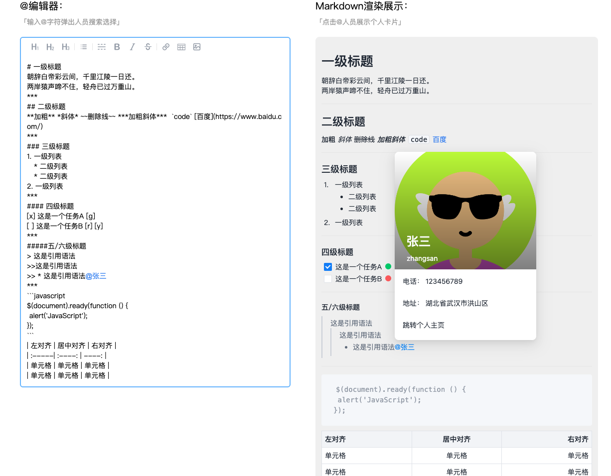

# markdown-editor

> - 编辑器：基于 contentEditable 实现，除了普通文本输入，还支持@选人功能。
> - Markdown 渲染展示：支持全量 Markdown 语法渲染、自定义语法(红绿灯)渲染、@人员渲染。
> - demo 页：左侧@编辑器输入框，右侧结果展示。



## 功能特性

**@编辑器组件**

- 支持 Markdown 工具栏
- 支持任意普通文本输入
- 支持@选人功能
- 支持@人员高亮展示
- 支持@人员整体删除
- 支持上下键选人
- 支持关键字模糊匹配
- 支持 placeholder
- 支持输入文本最大字符数限制
- 支持复制粘贴

**Markdown 渲染器**

- 支持全量 Markdown 语法渲染
- 支持自定义语法渲染，[g] [r] [y]红绿灯
- 支持@人员高亮展示
- 支持@人员点击事件
- 支持@人员点击展示个人卡片

**Tip： 可以根据自己业务需求调整@人员携带的数据信息，可以自定义个人卡片展示内容**

## 运行

1. git clone 项目
2. npm i
3. npm run start

## 代码结构

- 主要由三部分构成：@编辑器组件、Markdown 渲染器、使用 demo 页面。

```tree
.
├── src
│   ├── components
│   │   ├── at-mentions-editor           # @编辑器组件
│   │   ├── markdown-preview       # Markdown渲染器
│
│   ├── views
│   │   ├── home                  # 首页。组件使用demo。
│
└── README.md
```

## 相关文章

[输入框@选人功能实现](https://blog.csdn.net/qq_34484722/article/details/125649995)
